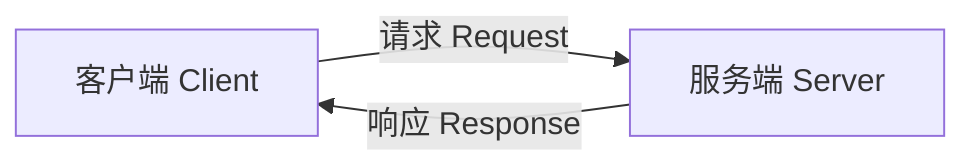

## 一、核心模型

服务通信是 **客户端 / 服务端** 模型，采用 **请求 / 响应** 方式。



- **客户端 Client**：发送请求，等待响应。
- **服务端 Server**：接收请求，处理，返回响应。
- **服务 Service**：通过服务名建立连接。

### 与话题的区别

| 对比项 | 话题 Topic | 服务 Service |
|---|---|---|
| 通信模型 | 发布 / 订阅 | 请求 / 响应 |
| 方向 | 单向，持续 | 双向，一次请求对应一次响应 |
| 同步性 | 异步 | 客户端可同步等待，也可异步等待 |
| 参与者 | 多对多 | 通常一个服务端，多个客户端 |
| 适用场景 | 传感器数据、状态广播 | 查询、计算、配置、触发短任务 |
| 接口文件 | `.msg` | `.srv` |

---
## 二、服务接口
服务接口文件用 `.srv` 后缀，内容分为两部分，中间用 `---` 分隔：

```text
请求字段
---
响应字段
```

- 上半部分是请求。
- 下半部分是响应。

ROS2 会根据 `.srv` 文件生成不同语言的接口类。客户端和服务端必须使用相同的服务接口。

### 接口是统称

在 ROS2 中，**接口 Interface** 是通信双方约定的数据格式的统称，主要包括：

| 通信方式 | 接口类型 | 文件后缀 |
|---|---|---|
| 话题 Topic | 消息接口 | `.msg` |
| 服务 Service | 服务接口 | `.srv` |
| 动作 Action | 动作接口 | `.action` |

所以：
- 话题中的消息类型就是接口，叫 **消息接口**。
- 服务中的类型也是接口，叫 **服务接口**。
- 动作中的类型也是接口，叫 **动作接口**。
### 查看接口

```bash
ros2 interface show <接口名>
```

`ros2 interface` 可以统一查看 `msg`、`srv`、`action` 三种接口。

---
## 三、服务通信特点
1. **请求 / 响应模式**  
   客户端发一个请求，服务端返回一个响应。
2. **通常一对一**  
   一个服务端可以处理多个客户端的请求，但每个请求只由一个服务端处理。  
   一般不建议一个服务名对应多个服务端，容易冲突。
3. **客户端可以同步等待，也可以异步等待**
   - **同步等待**：调用服务后阻塞，直到收到响应才继续执行。简单直观，但等待期间客户端做不了别的事。
   - **异步等待**：发出请求后立即返回，程序可以继续做其他事，响应到了再处理。不阻塞，更灵活，代码稍复杂。

4. **服务端可以并发处理，但默认可能串行**
   - **串行处理**：多个请求排队，一个接一个处理。默认执行器通常是单线程，回调默认在互斥回调组里，所以容易串行。
   - **并发处理**：多个请求同时处理。需要配置多线程执行器和可重入回调组，并注意线程安全。
   - **回调组**：
     - 互斥回调组：同一组内回调不能同时执行，必须排队。
     - 可重入回调组：同一组内回调可以同时执行，允许多线程并发。

5. **不适合长任务**  
   如果任务耗时很长，应该用 **动作 Action**，因为动作有反馈、可取消。服务适合短时间完成的操作。

---

## 四、服务 vs 动作 Action

| 对比项 | 服务 Service | 动作 Action |
|---|---|---|
| 通信模式 | 请求 / 响应 | 目标 / 反馈 / 结果 |
| 耗时 | 短任务 | 长任务 |
| 反馈 | 无 | 有持续反馈 |
| 取消 | 不支持 | 支持取消 |
| 适用场景 | 计算、查询、配置 | 导航、抓取、长时间任务 |

如果任务超过几秒，或者需要中间反馈、取消，优先用动作。

---

## 五、服务相关 CLI 工具

查看所有服务相关命令：

```bash
ros2 service -h
```

常见子命令：

| 命令 | 作用 |
|---|---|
| `list` | 列出所有服务 |
| `type` | 查看服务类型 |
| `call` | 手动调用服务 |
| `find` | 按服务类型查找服务 |

### 1. `ros2 service list`

列出系统中当前活动的服务：

```bash
ros2 service list
```

显示类型：

```bash
ros2 service list -t
```

常用选项：

- `-t`：显示服务类型
- `-c`：只显示数量
- `-v`：详细信息

### 2. `ros2 service type`

查看某个服务的类型：

```bash
ros2 service type <服务名>
```

配合查看接口定义：

```bash
ros2 interface show <服务接口>
```

### 3. `ros2 service find`

按服务类型查找服务：

```bash
ros2 service find <服务类型>
```

用途：

- 知道服务类型，但不知道服务名。
- 脚本中按类型筛选服务。

### 4. `ros2 service call`

手动调用服务：

```bash
ros2 service call <服务名> <服务类型> '<请求数据>'
```

注意请求数据使用 YAML 格式，冒号后要有空格。

### 5. `ros2 interface show`

查看接口定义：

```bash
ros2 interface show <接口名>
```

它属于 `ros2 interface`，不是 `ros2 service` 的子命令，但常用于查看服务接口。

---

## 六、常见问题与注意事项

1. **服务名冲突**  
   同一个服务名最好只有一个服务端。多个服务端会导致客户端不知道调用哪个。

2. **服务端未启动**  
   客户端调用前应等待服务可用，否则会失败。

3. **接口不一致**  
   客户端和服务端必须使用相同的 `.srv` 接口。

4. **YAML 冒号后空格**  
   手动调用服务时，请求数据格式要注意冒号后加空格。

5. **服务不适合长任务**  
   长任务用动作。

6. **QoS**  
   服务也有 QoS，但通常默认即可。如果通信异常，可以检查 QoS 配置。

7. **并发与线程安全**  
   服务端如果配置并发处理，多个线程可能访问共享数据，需要自己加锁保证线程安全。
