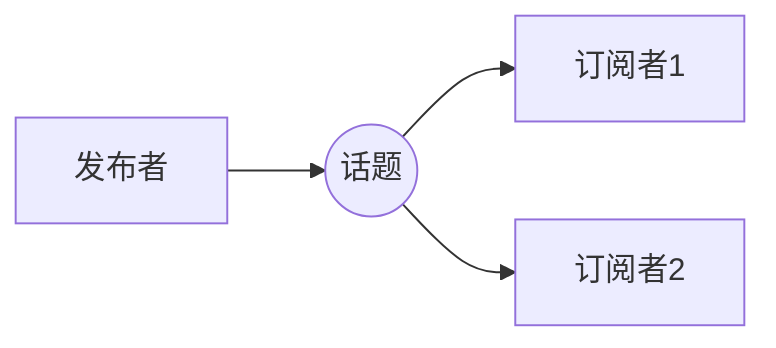
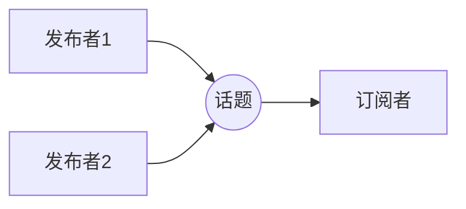
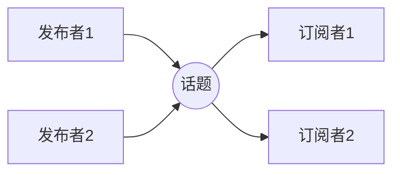

## 一、核心模型

### 1. 基本形式：发布 / 订阅


- **发布者 Publisher**：往话题上发数据
- **订阅者 Subscription**：从话题上收数据
- **话题 Topic**：命名通道，同名即建立联系
### 2. 特点
- **解耦**：发布者不知道谁订阅，订阅者不知道谁发布
- **异步**：发布者发消息时不要求订阅者立刻响应
- **多对多**：同一话题可有多个发布者、多个订阅者

### 3. 常见拓扑
#### 一对一

#### 一对多

#### 多对一

#### 多对多


> 自订阅：节点订阅自己发布的话题，可用于回环测试、状态广播、内部解耦，但要防止无限循环。

---

## 二、消息接口
### 1. 作用
发布者和订阅者必须约定数据格式，这个约定就是**消息接口**。
ROS2 自动完成：
- **序列化**：发布时，消息对象 → 字节流
- **反序列化**：订阅时，字节流 → 消息对象
### 2. 跨语言、跨平台、跨设备
定义好接口后，ROS2 生成不同语言的接口类：
- Python：`std_msgs.msg.String`
- C++：`std_msgs::msg::String`
因此 Python 节点发布，C++ 节点订阅，只要接口相同就能通信。
### 3. 重要规则
> **同一个话题，所有发布者和订阅者必须使用相同的消息接口。**

### 4. 示例
```bash
ros2 interface show std_msgs/msg/String
```
输出：
```text
string data
```
表示 `String` 消息只有一个字段：
- 类型：`string`
- 字段名：`data`
---

## 三、可视化工具：rqt_graph
demo示例：
```bash
# 终端1：启动监听者
ros2 run demo_nodes_py listener

# 终端2：启动发布者
ros2 run demo_nodes_cpp talker

# 终端3：打开可视化工具
rqt_graph
```
作用：
- 可视化节点和话题之间的数据流
- 看清哪个节点发布了什么话题，哪个节点订阅了什么话题
- 可尝试 `Hide`、`Group` 选项观察图的变化

---

## 四、CLI 工具：ros2 topic
查看所有子命令：
```bash
ros2 topic -h
```
子命令总览：

| 命令 | 作用 | 重要度 |
|---|---|---|
| `bw` | 显示话题带宽 | 中 |
| `delay` | 显示带 Header 话题的延迟 | 中 |
| `echo` | 打印实时话题内容 | 高 |
| `find` | 按消息类型查找话题 | 中 |
| `hz` | 打印平均接收频率 | 高 |
| `info` | 查看话题信息 | 高 |
| `list` | 列出所有话题 | 高 |
| `pub` | 手动发布消息 | 高 |
| `type` | 查看话题类型 | 高 |

### 1. `ros2 topic list`

列出当前活动话题：
```bash
ros2 topic list          # 列出所有话题
ros2 topic list -t       # 显示话题类型
ros2 topic list -c       # 只显示数量
ros2 topic list -v       # 详细信息


#示例输出：
/chatter [std_msgs/msg/String]
/parameter_events [rcl_intrfaces/msg/ParameterEvent]
/rosout [rcl_interfaces/msg/Log]
```

### 2. `ros2 topic info`

查看话题信息：

```bash
ros2 topic info /chatter

#输出：
Type: std_msgs/msg/String
Publisher count: 1
Subscription count: 1
```
详细模式：
```bash
ros2 topic info /chatter -v
```

可查看：发布者/订阅者节点信息、QoS 配置、GID 等底层信息。

用途：确认话题类型、确认是否有发布者/订阅者、排查 QoS 不匹配。

### 3. `ros2 topic type`

查看话题类型：
```bash
ros2 topic type /chatter

# 输出：
std_msgs/msg/String
```

配合查看消息定义：
```bash
ros2 topic type /chatter
ros2 interface show std_msgs/msg/String
```

### 4. `ros2 topic echo`

打印实时话题内容：
```bash
ros2 topic echo /chatter              # 实时打印
ros2 topic echo /chatter --once       # 只打印一条
ros2 topic echo /chatter --field data # 只打印 data 字段
```

输出示例：
```text
data: 'Hello World: 1'
---
data: 'Hello World: 2'
---
```

用途：确认话题有没有数据、消息内容是否正确、调试传感器/状态/日志等数据。

### 5. `ros2 topic pub`

手动发布消息：
```bash
ros2 topic pub /chatter std_msgs/msg/String '{data: "hello ros2"}' --once
```

格式：
```text
ros2 topic pub <话题名> <消息类型> '<YAML格式数据>'
```

常用选项：

- `--once`：只发一次
- `-r 10`：以 10 Hz 持续发布
- `--times`：发布指定次数
- `--qos-reliability`、`--qos-durability`：指定 QoS

示例：
```bash
# 只发一次
ros2 topic pub /chatter std_msgs/msg/String '{data: "123"}' --once

# 以 10 Hz 持续发布
ros2 topic pub /chatter std_msgs/msg/String '{data: "123"}' -r 10
```

**关键：YAML 冒号后必须有空格。**
```bash
ros2 topic pub /chatter std_msgs/msg/String '{data: "hello ros2"}' --once
```

### 6. `ros2 topic hz`
打印平均接收频率：
```bash
ros2 topic hz /chatter          # 默认窗口
ros2 topic hz /chatter -w 20    # 指定窗口大小
```

输出示例：
```text
average rate: 10.000
	min: 0.099s max: 0.101s std dev: 0.00050s window: 10
```
用途：检查发布频率是否正常、是否稳定、排查丢包/卡顿/频率抖动。
注意：`hz` 从接收端统计，网络、QoS、订阅者性能都会影响结果。

### 7. `ros2 topic bw`
显示话题带宽：
```bash
ros2 topic bw /chatter
ros2 topic bw /image_raw -w 50
```
用途：图像、点云、激光雷达等大消息；查看话题占用带宽；排查通信卡顿是否因数据量太大。

### 8. `ros2 topic delay`
显示话题延迟：
```bash
ros2 topic delay /imu
```
用途：评估传感器数据实时性、排查数据是否过期、对比不同节点/网络下的延迟。

注意：消息必须包含 `std_msgs/Header`，且发布者填了 `header.stamp`。  
像 `std_msgs/msg/String` 没有 Header，不能用 `delay`。

### 9. `ros2 topic find`
按消息类型查找话题：
```bash
ros2 topic find std_msgs/msg/String
```

输出：
```text
/chatter
```
用途：知道类型但不知道话题名、脚本中按类型筛选话题、确认某个类型的话题是否存在。

### 10. `ros2 interface show`
查看消息类型定义：
```bash
ros2 interface show std_msgs/msg/String
```

输出：
```text
string data
```
注意：它属于 `ros2 interface`，不是 `ros2 topic` 的子命令，但常配合话题调试使用。

## 五.  “ . ”的层级划分

### 1. 模块 → 子模块 → 类/函数

```text
rclpy.init
rclpy.spin
rclpy.shutdown
rclpy.ok
rclpy.node.Node
example_interfaces.srv.AddTwoInts
```

结构：

```text
模块 . 子模块 . 类/函数
```

---

### 2. 对象 → 属性

```text
request.a
request.b
response.sum
self.client_
self.add_ints_server_
```

结构：

```text
对象 . 属性
```

---

### 3. 对象 → 方法

```text
self.get_logger()
self.create_service()
self.create_client()
self.client_.wait_for_service()
self.client_.call_async()
result_future.result()
```

结构：

```text
对象 . 方法()
```

---

### 4. 链式调用

```text
self.get_logger().info()
self.client_.call_async(request).add_done_callback(...)
```

结构：

```text
对象 . 方法1() . 方法2()
```

前一个方法返回一个对象，再调用这个对象的方法。

---

### 5. 类 → 内部类

```text
AddTwoInts.Request
AddTwoInts.Response
```

结构：

```text
类 . 内部类
```

---

### 总图

```text
rclpy                          ← 模块
 ├── init()                    ← 函数
 ├── spin()                    ← 函数
 ├── shutdown()                ← 函数
 ├── ok()                      ← 函数
 └── node                      ← 子模块
      └── Node                 ← 类
           ├── get_logger()    ← 方法，返回 logger 对象
           │    └── info()     ← logger 对象的方法
           ├── create_service()
           └── create_client()

example_interfaces             ← 功能包
 └── srv                       ← 子模块
      └── AddTwoInts           ← 接口类
           ├── Request         ← 内部类
           │    ├── a          ← 属性
           │    └── b          ← 属性
           └── Response        ← 内部类
                └── sum        ← 属性

self                           ← 当前节点对象
 ├── get_logger()              ← 方法
 ├── create_service()          ← 方法
 ├── create_client()           ← 方法
 ├── add_ints_server_          ← 属性，保存服务端对象
 ├── client_                   ← 属性，保存客户端对象
 ├── handle_add_two_ints       ← 方法，服务端回调
 └── result_callback_          ← 方法，客户端响应回调

request                        ← AddTwoInts.Request 实例
 ├── a
 └── b

response                       ← AddTwoInts.Response 实例
 └── sum

result_future                  ← future 对象
 └── result()                  ← 方法，取出 Response
```
